# AI Commerce Copilot

AI Commerce Copilot is a local, single-user shopping chat. It turns a request into a constrained product-retrieval plan, retrieves products from DummyJSON, ranks them on the server, and saves both the conversation and the rendered product-card snapshots in PostgreSQL.

The model interprets language and writes a grounded reply; application code owns catalog access, filtering, ranking, persistence, and card data.

## README acceptance checklist

- [x] Local setup, run, database reset, and verification commands are documented.
- [x] Architecture choices and rejected alternatives are explained.
- [x] Retrieval endpoints, fixed-origin policy, and ranking rules are specified.
- [x] Ambiguous, off-catalog, and multi-intent requests have defined behavior.
- [x] Conversation persistence, snapshots, idempotent retries, and failure recovery are described.
- [x] Deterministic, integration, browser, offline, and optional online evaluation coverage and blind spots are explicit.
- [x] The product, catalog, memory, streaming, freshness, authentication, and checkout limitations are explicit.

## Local setup and run

Prerequisites: Node.js and npm, Docker Compose, and an OpenAI API key for normal interactive chat. The E2E and offline evaluation paths use deterministic fakes and do not call OpenAI or DummyJSON.

Copy the environment template, set `OPENAI_API_KEY` in `.env`, and run the application in this order:

```bash
cp .env.example .env
docker compose up -d database
npm install
npm run db:migrate
npm run dev
```

Open the URL printed by Next.js, normally `http://localhost:3000`. `npm run db:migrate` uses the local `DATABASE_URL` from `.env` and applies the committed Prisma migrations. The Compose service publishes PostgreSQL on `localhost:5432` and initializes an isolated `ai_commerce_test` database for integration and E2E tests.

The database is the persistence boundary:

```bash
docker compose down
docker compose down -v
```

`docker compose down` stops and removes containers but preserves the `postgres_data` volume, so local conversation history remains. `docker compose down -v` also removes that volume and therefore deletes all local conversation history. Reloading a deleted `/conversations/:id` URL renders Next.js's 404 page. During an already-open client session, a request that discovers the missing conversation shows the client recovery control to start a new conversation; it never silently recreates history.

For a fresh test schema, export the variables from `.env` and run the migrations against `TEST_DATABASE_URL`:

```bash
set -a
source .env
set +a
DATABASE_URL="$TEST_DATABASE_URL" npm run db:migrate:deploy
```

Playwright Chromium must be installed once on a new machine:

```bash
npx playwright install chromium
```

## Architecture and decisions

Next.js App Router provides both the React interface and explicit route-handler BFF in one TypeScript application. Route handlers validate HTTP input, keep secrets server-side, translate errors, call domain services, and return persisted conversation data. PostgreSQL holds conversations, messages, and immutable product-card snapshots; Prisma schema and committed Prisma Migrate migrations define that data boundary, and one server-only Prisma client owns database access.

```mermaid
flowchart LR
  UI["Next.js chat UI"] --> API["Route handlers / BFF"]
  API --> DB[("PostgreSQL")]
  API --> PLAN["OpenAI retrieval plan"]
  PLAN --> CATALOG["Deterministic catalog resolver"]
  CATALOG --> DUMMY["DummyJSON products API"]
  CATALOG --> REPLY["OpenAI grounded reply"]
  REPLY --> DB
  DB --> UI
```



The choices are intentionally plain:

| Rejected option                         | Why it is not used here                                                                                                                                                           |
| --------------------------------------- | --------------------------------------------------------------------------------------------------------------------------------------------------------------------------------- |
| React frontend plus a separate Node API | Two applications would add CORS, proxy, development-server, and deployment overhead without improving this local product. Next.js keeps the same HTTP boundary in one codebase.   |
| Vercel AI SDK                           | It is useful for streaming chat transport, but this application intentionally does not stream. The official OpenAI SDK is the smaller surface to explain.                         |
| LangChain, LangGraph, or Mastra         | A workflow framework would add abstraction around a single read-only catalog tool and conceal the request-to-recommendation flow rather than simplify it.                         |
| SQLite                                  | PostgreSQL in Docker Compose better demonstrates a reproducible server-owned relational persistence boundary, migrations, and a separate test database.                           |
| Raw `node-postgres` queries             | Hand-maintained SQL mapping and migrations would be more verbose. Prisma supplies generated TypeScript types and reviewed migrations while keeping repository ownership explicit. |
| Hosted database                         | A hosted service would require authentication, authorization, tenancy, privacy, and network-resilience work outside this local project's scope.                                        |

The model/data boundary is strict. The planner emits a validated retrieval plan; it does not choose hosts, HTTP methods, paths, headers, or arbitrary URLs. The server is the only component allowed to retrieve catalog data, rank candidates, write the database, or construct product cards. The reply model receives only the selected trusted card data. Cards render from saved snapshot DTOs, never by parsing model prose, so past cards preserve the title, description, price, category, rating, and image that were actually recommended. They are not live price or availability guarantees.

Responses are deliberately non-streaming. A pending assistant state is clearer than a partial response whose text and cards could disagree, and lets the completed text and persisted cards arrive together. Streaming can be added later if it preserves that persistence and grounding boundary.

## Retrieval policy

The catalog origin is fixed to `https://dummyjson.com`; `.env` cannot redirect it to another host. All upstream requests are read-only `GET`s and JSON is schema-validated. `DUMMYJSON_TIMEOUT_MS` configures the request timeout and defaults to 5,000 milliseconds; network or upstream-5xx failures get at most one retry.

| Request kind    | DummyJSON endpoint and server policy                                                      |
| --------------- | ----------------------------------------------------------------------------------------- |
| Text search     | `GET /products/search?q=...&limit=100`, followed by local filters and ranking.            |
| Category browse | `GET /products/category/:slug?limit=100`; category slugs must be in the server allowlist. |
| Generic browse  | `GET /products?limit=100`.                                                                |
| Product detail  | `GET /products/:id`, only for one product ID already shown in the active conversation.    |
| Comparison      | `GET /products/:id` for exactly two product IDs already shown in the active conversation. |

The planner can request at most two search terms, a known category, maximum price, minimum rating, stock state, one of four sort values, and up to two prior product references. The server validates every field and rejects extra or incompatible fields before retrieval. Search/category results are filtered locally. Results are capped at six cards and ranked deterministically: exact title or token matches first, then the requested explicit sort (`price_asc`, `price_desc`, or `rating_desc`) when present; relevance preserves upstream candidate order; product ID is the final tie-breaker.

Ambiguous messages receive one targeted clarification when the missing detail would materially alter results; otherwise the assistant states the assumption it used. Off-catalog requests say that the current DummyJSON catalog cannot provide the item, rather than searching the web or inventing alternatives. One request produces one ranked product-card list of at most six items; separate result groups are not implemented, so multi-intent requests are clarified rather than merged into a mixed list. User and catalog text are data, not instructions.

## Conversations and recovery

An unsent draft exists only in the browser. The first submitted message atomically creates a conversation, deterministic title, user message, and pending assistant message. Later requests persist the user message and pending reply before any model call. Each request has a client-generated request ID scoped to its conversation, making retry idempotent: a duplicate completed or pending request reuses its original assistant message, and a failed request transitions back to pending rather than duplicating the user message.

The sidebar lists persisted conversations by most-recent update. Resuming a conversation loads its saved messages and card snapshots. Only the latest twelve completed messages and their prior product IDs reach the planner. There is no cross-conversation preference memory or profiling.

| Failure                                    | User-visible behavior                                                                                                                                                                                                                                                                                                                               |
| ------------------------------------------ | --------------------------------------------------------------------------------------------------------------------------------------------------------------------------------------------------------------------------------------------------------------------------------------------------------------------------------------------------- |
| PostgreSQL unavailable before generation   | The request fails early as a persistence error; the app does not send an unrecordable request to the model.                                                                                                                                                                                                                                         |
| Database write fails after model work      | The assistant response is not marked complete. The server retains the grounded completion by conversation/message ID while the local process runs and marks the persisted reply failed when storage is reachable. The same request ID then replays that completion into the original conversation without a second model call or duplicate message. |
| OpenAI failure or timeout                  | The user message stays saved, the assistant message becomes retryable failed state, and no replacement answer is invented.                                                                                                                                                                                                                          |
| DummyJSON timeout, 5xx, or invalid payload | A retryable catalog error is distinct from a valid empty result; prior history remains usable.                                                                                                                                                                                                                                                      |
| Invalid model plan                         | The response is failed safely; invalid model output never selects arbitrary endpoints or cards.                                                                                                                                                                                                                                                     |
| Local volume cleared                       | Reloading a deleted conversation URL is a 404. An active client request receives an explicit unknown-conversation state and can start new history.                                                                                                                                                                                                  |

## Verification and evaluation

Run the final local quality gate after PostgreSQL is healthy and the test database is migrated:

```bash
npm run prettier
npm run lint
npm run build
npm run test
npm run test:e2e
npm run eval:offline
```

| Layer                   | What it catches                                                                                                                   | Boundary                                                                                                                         |
| ----------------------- | --------------------------------------------------------------------------------------------------------------------------------- | -------------------------------------------------------------------------------------------------------------------------------- |
| Unit tests              | Plan validation, endpoint selection, filtering, stable ranking, snapshot mapping, typed errors, chat orchestration, and UI state. | Uses fakes; no live OpenAI or DummyJSON.                                                                                         |
| Integration tests       | Route, service, repository, persistence, request-ID retry, and database-recovery behavior.                                        | Uses the migrated local PostgreSQL test database and fake model/catalog clients.                                                 |
| Browser E2E             | Send, card render, reload persistence, resume, new conversation, no-result, and recovery flows.                                   | Starts Next.js in development with `E2E_MODE=true`, the test database, and deterministic server-only clients.                    |
| Offline evaluation      | Versioned fixture scenarios for plan validity, intent, constraints, selected IDs, grounding, and latency.                         | `npm run eval:offline` writes a JSON report under `artifacts/evaluations/`; it is deterministic and does not assess exact prose. |
| Online smoke evaluation | Small integration-health check against real OpenAI and DummyJSON.                                                                 | Optional, external, availability-dependent, and cost-capped to three scenarios; it is never CI-blocking.                         |

Deterministic tests assert structured effects and invariants, not exact assistant wording. The optional online command is intentionally opt-in and only runs when explicitly requested:

```bash
RUN_ONLINE_EVAL=true npm run eval:online
```

It requires a real `OPENAI_API_KEY`, can incur API cost, and can fail because a third-party service is unavailable. An optional LLM judge may be useful for tone or usefulness review, but it is not a correctness guarantee and does not replace deterministic assertions or human review.

## Known limitations

- The catalog is DummyJSON only: its data can be incomplete, stale, or unrealistic, and search quality is limited by its candidates and the simple deterministic ranker.
- There is no live freshness check for saved cards; a historic snapshot is not a current price, stock, or availability promise.
- Memory is limited to bounded history in the active conversation. There is no cross-conversation preference memory, user profile, deletion, or archive feature.
- Responses do not stream.
- This is unauthenticated and single-user; it has no authorization, tenancy, or production deployment hardening.
- There is no cart, payment, checkout, inventory reservation, product mutation, or purchase flow.
- Offline scenarios and deterministic fakes cannot exhaustively prove behavior for unseen natural-language prompts. Online smoke evaluation is deliberately small and is not a reliability or quality guarantee.
- The post-model persistence recovery cache is process-local. A server restart before the failed completion is persisted loses that in-memory completion; this local application does not claim durable external-model idempotency across process restarts.
