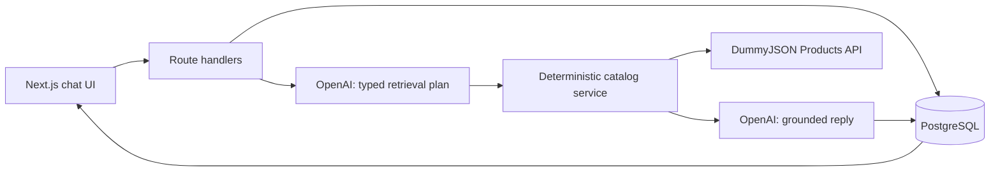
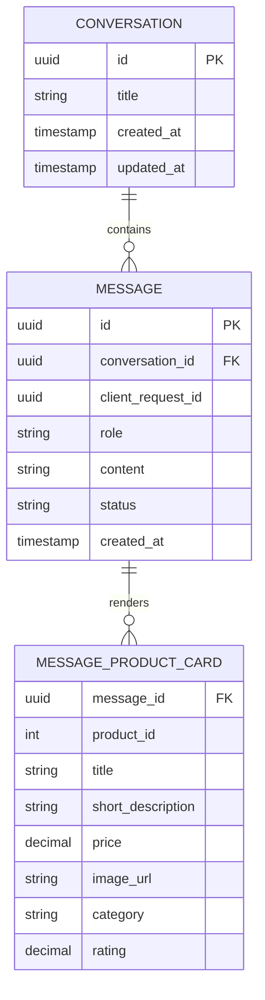

# AI Commerce Copilot Design

## Goal

Build a locally runnable shopping copilot that turns a user's conversational request into grounded DummyJSON product recommendations. It must render products as in-chat cards, preserve conversations across refreshes, let the user start and resume conversations, and make its behavior explainable in an interview.

The guiding boundary is: the model interprets language; deterministic server code retrieves catalog data, filters and ranks it, persists state, and renders product facts.

## Scope

### Included

- Conversational product discovery, refinements, product details, and comparisons.
- In-chat product cards containing an image, title, short description, price, category, and rating when present.
- New conversation, recent-conversation list, and resuming a previous conversation.
- PostgreSQL persistence through Docker Compose.
- Deterministic unit, integration, and browser tests, plus offline and online model-evaluation commands.
- Honest loading, empty, unsupported-request, and retryable-error states.

### Explicitly deferred

- Cross-conversation user-preference memory or inferred user profiling.
- Deletion/archive controls.
- Streaming responses.
- Live refresh of historic recommendation price or availability.
- Authentication, multi-user access, hosted deployment, cart, checkout, and product mutations.
- Tools or external search beyond the DummyJSON product catalog.

Historic product cards are immutable snapshots of what was recommended. They include a recommendation timestamp and are not presented as a live price or availability guarantee. A later live-freshness feature can enrich a snapshot without replacing it.

## Architecture Choice

Use Next.js App Router with TypeScript, route handlers as a backend for frontend (BFF), the official OpenAI SDK, Prisma ORM, PostgreSQL, and Docker Compose.



The BFF keeps the OpenAI credential private and is the sole owner of input validation, model requests, catalog access, persistence, error translation, and product-card rendering data.

### Alternatives considered

| Alternative | Rejection rationale for this assignment |
|---|---|
| React frontend plus Express/Fastify API | The separate applications add CORS, development-server, proxy, and deployment concerns without improving the single-user local product experience. Next.js provides the same explicit HTTP boundary in one TypeScript application. |
| Next.js plus Vercel AI SDK | A useful option for token streaming and chat transport, but streaming is deliberately out of scope. The official OpenAI SDK leaves fewer version-dependent abstractions to explain. |
| LangChain, LangGraph, or Mastra | These frameworks help coordinate multiple tools, durable agent workflows, or advanced observability. This app has one read-only catalog boundary, so an agent runtime would obscure rather than simplify the request-to-recommendation flow. |
| SQLite | SQLite is a valid lightweight local database, but PostgreSQL in Docker Compose better demonstrates a reproducible, server-owned relational persistence boundary and a migration/test-database workflow. |
| Raw node-postgres queries | Direct SQL offers total control, but would require hand-maintained schema mapping, SQL migrations, and more verbose transactional query code. Prisma provides generated TypeScript types and reviewed migrations while the repository retains the application boundary. |
| Hosted database | It would require authentication, authorization, tenancy, privacy controls, and network resilience that the locally runnable assignment does not need. |

## Model and Retrieval Design

Use `gpt-5.4-mini` for the planning and response-generation path. `gpt-5.4-nano` is not used initially; it can be evaluated later for a tightly measured, simpler classification task. The API key lives only in an ignored environment file and is never passed to the browser, logs, fixtures, or repository.

The request flow uses two bounded model steps:

1. A planner converts the user message, bounded active-conversation history, and prior product-card identifiers into a strict retrieval plan.
2. The server validates and executes that plan using fixed DummyJSON endpoints, then filters and ranks candidates deterministically.
3. A reply generator receives only trusted, selected product data and writes concise conversational text. The UI product cards are rendered from the deterministic product-card DTO, not parsed from that text.

For `clarify` and `unsupported` plans, the planner returns a safe question or catalog limitation response and retrieval does not run.

### Retrieval-plan contract

```ts
type RetrievalPlan = {
  intent: "search" | "browse_category" | "product_detail" | "compare" | "clarify" | "unsupported";
  searchTerms: string[];
  categorySlug: string | null;
  maxPrice: number | null;
  minRating: number | null;
  inStock: boolean | null;
  sort: "relevance" | "price_asc" | "price_desc" | "rating_desc";
  referencedProductIds: number[];
  assistantMessage: string | null;
};
```

The server validates the exact schema and rejects extra fields. It limits search-term count and length, accepts only category slugs from the API category allowlist, bounds numeric values, accepts only declared sort values, and permits referenced product IDs only when they appeared in the active conversation. The model cannot select a host, HTTP method, path, header, or arbitrary URL.

### Catalog policy

| Intent | Resolution |
|---|---|
| Text search | `GET /products/search?q=...` then local filtering. |
| Category browse | `GET /products/category/:slug`. |
| Text plus category, budget, rating, or stock filter | Search candidates, then locally apply all requested intersections. |
| Product detail | Resolve an existing conversation-card ID, then use `GET /products/:id` only when more fields are needed. |
| Comparison | Resolve up to two existing conversation-card IDs and compare only retrieved fields. |
| Generic browse | `GET /products` with bounded pagination. |

DummyJSON does not expose a rich combined search/filter endpoint. The catalog service therefore applies a documented, stable ranking rule: exact title or token matches first, upstream candidate order second, explicit sort third, and product ID as the final tie-breaker. It returns a bounded number of products.

Ambiguous requests receive one targeted clarification when a missing variable materially changes results. Otherwise, the assistant states the assumption used. Off-catalog requests state that the current catalog cannot provide the item; they do not trigger unrelated web search or invented alternatives. A message may yield at most two independent groups of results; larger multi-intent requests are clarified.

User text and catalog text are untrusted data, never instructions. The system prompt and server validation confine model behavior to the catalog contract. Read-only upstream GET requests have a fixed timeout and at most one bounded retry.

## Conversations and Persistence

PostgreSQL runs in Docker Compose with a persisted local volume. Prisma Schema is the database-model source of truth and Prisma Migrate creates versioned, committed migrations. Prisma Client is configured once as a Next.js-safe singleton through the PostgreSQL driver adapter; the repository remains the only domain code allowed to query it. Development configuration uses an ignored environment file; `.env.example` documents required variables. A separate test database is migrated and truncated for integration tests.

This is an unshipped local application. Migrations created during implementation need to support fresh installs and the project test databases; they do not claim to infer associations from unknown, pre-existing production conversations. Once the application has persisted user data, every schema migration must explicitly provide either a safe data backfill or a typed recovery path for records whose relationship cannot be inferred.



An empty draft conversation exists only in the client. The first submitted message creates the conversation, its user message, and a pending assistant message atomically. Conversation titles are a deterministic truncation of the first user message, avoiding a needless model call. The sidebar lists conversations by `updated_at` descending.

Only a bounded recent history from the active conversation is passed to the model. No preference memory is derived across conversations. A completed assistant message and its product-card snapshots are committed atomically. Each send carries a client-generated request ID, unique within a conversation. Retrying the same request updates its pending or failed assistant message instead of duplicating the user message.

### Failure and recovery behavior

| Condition | Behavior |
|---|---|
| DummyJSON timeout, 5xx, or invalid payload | Return a typed retryable catalog failure distinct from a valid no-results response. Keep prior history usable. |
| OpenAI failure or timeout | Preserve the user message and show a retryable assistant failure. Do not invent a replacement answer. |
| PostgreSQL unavailable before generation | Fail early with a clear persistence-unavailable error rather than sending an unrecordable request to the model. |
| PostgreSQL write failure after a model response | Do not mark the response complete. When storage is reachable, mark the pending reply failed so the existing request-ID retry flow can atomically resume one replacement generation without duplicating messages. |
| Database migration failure | Stop persistence-dependent requests with a local setup error rather than mixing schema versions. |
| Database volume cleared while the browser is open | A subsequent request finds an unknown conversation. The UI explains that local history was cleared and offers a new conversation rather than silently recreating prior history. |
| Docker volume removed | History is gone by design; the README explains that the volume is the persistence boundary. |

## User Experience and HTTP Contract

The application is chat-first. The desktop layout places a new-conversation control and recent-conversation list beside the active chat. Assistant recommendations appear as accessible in-chat product cards. Mobile layout stacks or horizontally scrolls cards while preserving message order.

The UI has explicit empty, sending, unsupported, no-results, and retryable-error states. Non-streaming responses use a clear pending state; the user receives a completed text response and cards together.

| Method and route | Purpose |
|---|---|
| `GET /api/conversations` | List persisted conversation summaries. |
| `GET /api/conversations/:id` | Load a conversation, messages, and product-card snapshots. |
| `POST /api/conversations` | Create a conversation from its first user message and a client request ID. |
| `POST /api/conversations/:id/messages` | Continue an existing conversation; retries reuse the same client request ID. |
| `GET /` | New, unsaved conversation route. |
| `GET /conversations/:id` | Resumed conversation route. |

Route handlers expose an explicit HTTP contract rather than Server Actions because the contract is straightforward to integration-test and error states remain visible at the client/server boundary.

## Testing and Evaluation

External dependencies are behind explicit interfaces:

- `ModelClient` produces retrieval plans and grounded replies.
- `CatalogClient` reads DummyJSON and normalizes product data.
- `ConversationRepository` owns PostgreSQL persistence through Prisma Client.

Production implementations call the real services. Test fakes make the deterministic application behavior reproducible.

| Layer | Scope | Runs in normal CI |
|---|---|---|
| Unit | Plan validation, endpoint selection, filters, stable ranking, snapshot mapping, and typed-error mapping. | Yes |
| Integration | Route/service/repository behavior with fake model/catalog clients and migrated test Postgres. | Yes |
| Browser E2E | Send, card render, reload persistence, resume, new conversation, no-result, and recovery flows. | Yes |
| Offline model evaluation | Versioned scenario set against fixture catalog data; record plan validity, selected IDs, grounding, and rubric outcomes. It may call a real model but is run outside user traffic. | Manual before submission |
| Online smoke evaluation | Cost-capped real OpenAI and real DummyJSON checks for integration health. | Manual; never CI-blocking |

The scenario set covers category and budget requests, refinement follow-ups, ordinal detail references, comparisons, bounded multi-intent queries, ambiguity, off-catalog requests, prompt-injection attempts, malformed upstream data, model failures, and database failures.

Tests assert structured effects and invariants, not exact model prose. Examples include: every rendered product ID belongs to the retrieved candidate set; every rendered price comes from the saved card DTO; a max-price filter is respected; and unsupported requests never make an unapproved outbound request. An optional LLM judge may assess tone and usefulness, but it is supplementary to deterministic assertions and human review.

## Security, Observability, and Limitations

- Validate request body size, message content, identifiers, model output, and every upstream payload at boundaries.
- Store the OpenAI key only server-side. Do not write it to the client, logs, test output, or source control.
- Use a fixed DummyJSON base URL and URL-encoded query parameters.
- Log request IDs, plan type, endpoint class, candidate and returned counts, latency, and typed failures. Avoid logging raw user messages or credentials by default.
- This local app has no authentication or authorization. It must not be described as multi-user or production-ready.

Known limitations: search quality is limited by DummyJSON data and simple deterministic ranking; no cross-conversation memory, streaming, or historical-card freshness exists; the catalog supports no real purchase flow; and offline evaluation cannot exhaustively prove language quality for unseen prompts.

## README Commitments

The README will include setup and Docker instructions, required environment variables, architecture rationale with the alternatives above, endpoint and retrieval policy, persistence and failure behavior, test/evaluation commands and their coverage limits, and the known limitations list.
