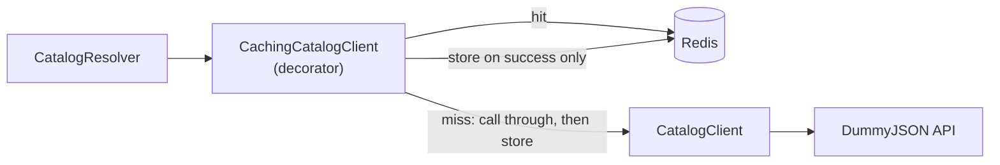

# DummyJSON Catalog Cache Design (YAN-12)

## Goal

Every `searchProducts`/`listCategoryProducts`/`listProducts`/`getProduct` call in `CatalogClient` currently re-fetches DummyJSON fresh, with no cache. Under concurrent users asking overlapping things, upstream call volume scales with total traffic instead of unique queries, adding latency and upstream-rate-limit risk. Add a caching layer in front of `CatalogClient` that survives app restarts, without `CatalogResolver` or any other consumer becoming aware caching exists.

## Scope

### Included

- A `CachingCatalogClient` decorator implementing `CatalogClientContract`, wrapping the existing `CatalogClient`.
- A Redis-backed cache store (new `redis` service in `compose.yaml`, new `ioredis` dependency), so cached data survives an app-process restart, not just the lifetime of one in-memory `Map`.
- Fixed TTLs per endpoint family (list/search vs. detail), env-configurable with sane defaults.
- Fail-open behavior on Redis errors: a Redis outage degrades to today's no-cache behavior, never a new failure mode.
- Simple in-app hit/miss counters.

### Explicitly deferred

- **Generic, reusable caching abstraction.** This was floated during brainstorming, but the follow-up decision was to keep this narrowly scoped to the catalog client only. `ReplyCompletionCache` and any future caches are not touched or refactored here.
- **Active/event-driven invalidation.** DummyJSON is a static demo dataset, so a fixed TTL is safe and no invalidation event exists to listen for. If this ever points at a catalog that actually changes, the cache will need some notification (webhook, pub/sub, poll-and-diff) to invalidate affected keys on write — that's a real gap, not a design oversight, and is left as a follow-up problem for whenever a live catalog source is introduced.
- **Negative caching of 404s.** `getProduct` throwing `NOT_FOUND` is never cached. This isn't a real hot path today: `CatalogResolver.validatePlan` already runs `retrievalPlanSchema` (Zod, `z.number().int().positive()`) on `referencedProductIds` before `catalogClient.getProduct` is ever called, so malformed IDs can't reach the client, cached or not — only genuinely deleted/nonexistent DummyJSON IDs would 404, which is rare enough not to warrant negative-cache complexity.
- **Provider-level Redis metrics/dashboards.** No hosting platform is chosen for this project yet (no `Dockerfile`/`vercel.json` in the repo); only simple in-app counters are in scope.

## Architecture



`CachingCatalogClient` lives in `src/domain/catalog/caching-catalog-client.ts`, alongside `catalog-client.ts` — same decorator-over-`CatalogClientContract` relationship the ticket describes, matching this repo's existing HTTP-client-wrapper convention. `CatalogResolver`'s constructor is unchanged; it still just takes a `CatalogClientContract`.

The Redis connection itself lives in `src/lib/redis/redis-client.ts`, following the exact singleton pattern `src/lib/db/prisma.ts` already uses for Postgres — a `globalThis` guard so Next.js dev hot-reload doesn't spawn duplicate connections, one shared connection reused across requests.

### Alternatives considered

| Alternative | Rejection rationale |
|---|---|
| In-memory `lru-cache` (npm package), per the ticket's original suggestion | Ticket's own suggested approach, and would have been the default recommendation absent further input — but doesn't survive an app-process restart, and the explicit ask was for persistence across restarts. Also becomes redundant once Redis owns TTL+eviction — no reason to run two separate eviction mechanisms in the same request path. |
| Hand-rolled `Map` + TTL, no new dependency | Same restart-survival gap as `lru-cache`, plus reimplements LRU eviction logic this repo would otherwise get for free from an established library — against the "prefer established packages" convention. |
| Generic `Cache<T>` / `RedisCache<T>` abstraction reusable across domains | Explicitly decided against in brainstorming follow-up (F2) — narrower scope now, revisit only if a second consumer (e.g. an upgraded `ReplyCompletionCache`) actually needs it. Building the generic shape today would be speculative. |
| Fail-closed on Redis errors (surface as `UPSTREAM_UNAVAILABLE`) | Would make a Redis blip break catalog browsing even when DummyJSON itself is healthy — a new failure mode this ticket would introduce that didn't exist before. Rejected in favor of fail-open. |

## Components

### `src/lib/redis/redis-client.ts` (new)

Singleton `ioredis` connection, constructed from `environment.redisUrl`. Same `globalThis`-guard shape as `prisma.ts`.

### `src/domain/catalog/caching-catalog-client.ts` (new)

```ts
export class CachingCatalogClient implements CatalogClientContract {
  public constructor(
    private readonly wrapped: CatalogClientContract,
    private readonly redis: Redis,
    private readonly config: { listTtlSeconds: number; detailTtlSeconds: number },
  ) {}

  // searchProducts, listCategoryProducts, listProducts, getProduct, listCategorySlugs
  // each: build namespaced key -> try redis GET -> hit: deserialize & return (increment hits)
  //       miss: call wrapped method -> on success, SETEX key with bucket TTL (increment misses)
  //             -> on CatalogError, propagate without caching (increment misses)
  //             -> on redis GET/SETEX error, log and fail open (call wrapped directly)

  public getCacheStats(): { hits: number; misses: number };
}
```

**Key namespacing** (all prefixed `catalog:v1:` — the version segment guards against deserializing stale-shaped JSON after a future `CatalogProduct` schema change):

| Method | Key | TTL bucket |
|---|---|---|
| `searchProducts(term)` | `catalog:v1:search:<trim+lowercase(term)>` | list (5 min) |
| `listCategoryProducts(slug)` | `catalog:v1:category:<slug>` | list (5 min) |
| `listProducts()` | `catalog:v1:list:all` | list (5 min) |
| `getProduct(id)` | `catalog:v1:product:<id>` | detail (30 min) |
| `listCategorySlugs()` | `catalog:v1:category-slugs` | detail (30 min) |

Values already passed through `CatalogClient`'s Zod validation once before being cached, so cache hits deserialize trusted JSON without re-validating.

### `compose.yaml`

New `redis` service, same shape as the existing `database` service:

```yaml
redis:
  image: redis:8-alpine
  command: redis-server --maxmemory 256mb --maxmemory-policy allkeys-lru
  ports:
    - "6379:6379"
  healthcheck:
    test: ["CMD", "redis-cli", "ping"]
    interval: 5s
    timeout: 5s
    retries: 5
```

No volume: this is a cache, not source-of-truth data, so losing it on a container restart is expected and harmless (matches the ticket's own "fixed TTL is safe" reasoning). Eviction is handled by Redis's own `allkeys-lru` policy at the configured `maxmemory` ceiling, not an app-level entry count.

### `src/lib/env.ts` / `src/lib/types.ts`

New env vars, following the existing `DUMMYJSON_*` pattern:

- `REDIS_URL` — `z.url().default("redis://localhost:6379")`
- `CATALOG_CACHE_LIST_TTL_SECONDS` — `z.coerce.number().int().positive().default(300)`
- `CATALOG_CACHE_DETAIL_TTL_SECONDS` — `z.coerce.number().int().positive().default(1800)`

Added to `Environment` type as `redisUrl`, `catalogCacheListTtlSeconds`, `catalogCacheDetailTtlSeconds`.

### `src/app/api/conversation-dependencies.ts`

Catalog client construction is hoisted to module scope (same level as the existing `replyCompletionCache` singleton), so the Redis connection and hit/miss counters are shared across requests instead of being rebuilt per call:

```ts
const catalogClient: CatalogClientContract = environment.e2eMode
  ? new FixtureCatalogClient()
  : new CachingCatalogClient(
      new CatalogClient(fetch, environment.dummyJsonBaseUrl, environment.dummyJsonTimeoutMs),
      redisClient,
      {
        listTtlSeconds: environment.catalogCacheListTtlSeconds,
        detailTtlSeconds: environment.catalogCacheDetailTtlSeconds,
      },
    );
```

`getConversationApiDependencies()` then just passes this module-level `catalogClient` into `new CatalogResolver(...)`, same as today.

## Error handling

- Any thrown `CatalogError` (`NOT_FOUND`, `UPSTREAM_UNAVAILABLE`, `INVALID_UPSTREAM_PAYLOAD`) from the wrapped client is never cached and propagates unchanged.
- Any Redis operation failure (connection refused, timeout) is caught, logged, and treated as a cache miss — the call falls through to the real `CatalogClient`. A Redis outage never surfaces as a new user-facing error that didn't exist before this ticket.

## Testing

- **Unit** (`src/domain/catalog/caching-catalog-client.test.ts`, existing `vitest.config.ts`): inject an `ioredis-mock` instance (new devDependency). Covers: miss calls wrapped and stores; hit skips wrapped entirely; correct TTL passed per bucket; thrown `CatalogError` never cached; Redis operation failure falls open to the wrapped client without throwing; search-term normalization collapses equivalent keys.
- **Integration** (`tests/integration/catalog-cache.integration.test.ts`, existing `vitest.integration.config.ts`): exercises a real Redis via `compose.yaml`, mirroring `conversation-repository.integration.test.ts`'s pattern for Postgres.
- **`env.test.ts`**: new cases for `REDIS_URL` validation and TTL defaults.

## Open follow-ups (not this ticket)

- Event-driven cache invalidation, if the catalog source ever stops being a static demo dataset.
- Whether a generic cache abstraction is worth extracting, if a second cache consumer (e.g. `ReplyCompletionCache`) needs the same Redis-backed persistence-across-restart property.
